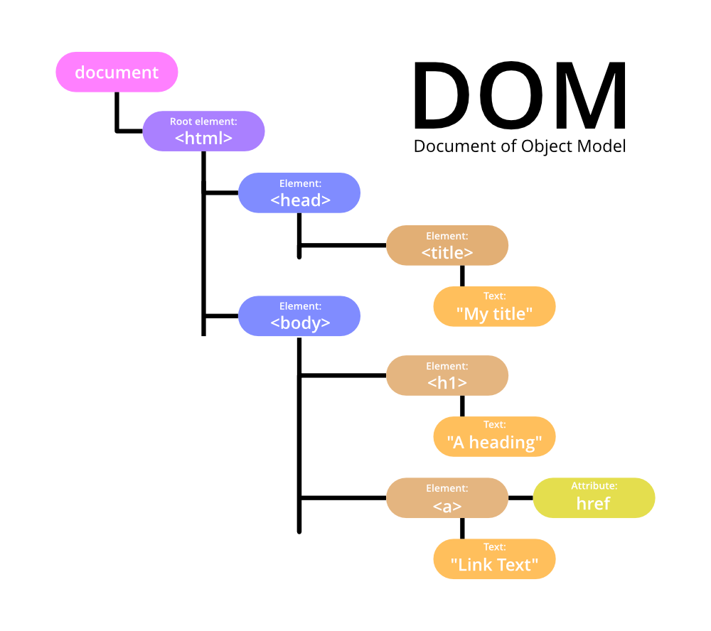

# JS en la modificación de páginas web

Las modificaciones de las que nos encargaremos serán crear nuevo HTML de forma dinámica y manejar multimedia, animar imágenes, variar estilos y textos de cada HTML de forma dinámica y en tiempo real.

---

## DOM

Para hacer esto necesitamos el manejo del **DOM** (esto lo permite JS y pocos lenguajes más). Con HTML veíamos esta estructura:

```html
<html>
    <head>
    </head>
    <body>
        <h1>
    </body>
</html>
```

La estructura de **DOM**, que es un árbol por el que puedes acceder a todo el contenido que tiene la web y manejarla a nuestro gusto, se ve así:

<div align="center">
    
</div>

JS nos permite **acceder a elementos** del **DOM** de la siguiente forma:

1. Para seleccionar un elemento por su **id**: función `document.getElementById('identificador')`.
2. Devolver una colección de todos los elementos que coinciden con la **clase** especificada: `document.getElementsByClassName('clase')`
3. Acceder por el nombre de su **etiqueta**: `document.getElementsByTagName('tag')`.

*Otra forma* de hacerlo sería:

1. Devolver el **primer elemento** que coincida con el selector de `css`: `document.querySelector('selector')`.
   1. Si el selector es una **etiqueta** se pone como `'div'`.
   2. Si es un **id** `'#id'`.
   3. Si es una **clase** `'.clase'`.
2. Retornar una **lista con todos los elementos** que coincidan con el selector `css`: `document.querySelectorAll('selector')`.

**Una vez seleccionado el elemento a alterar se puede**:

1. **Manipular** el contenido obteniendo o estableciendo un contenido `html`: `.innerHTML`.
2. Para **añadir** un texto a un elemento de forma directa (para parrafos y tal): `.textContent`.
3. **Cambiar** el estilo del elemento: `.style`.
4. Para **añadir, eliminar y alternar** entre clases `css`: `.classList`.
5. **Crear un evento** para que una modificación se produzca: `.addEventListener('evento', funcion)`.

> Podemos ver de ejemplo basiquísimo el [html](./index.html) y el [js](./script.js)!!
> El proximo dia empezamos a practicar mas y mas todo esto! Una web waparda que vamos a hacer añadiendo JS :P